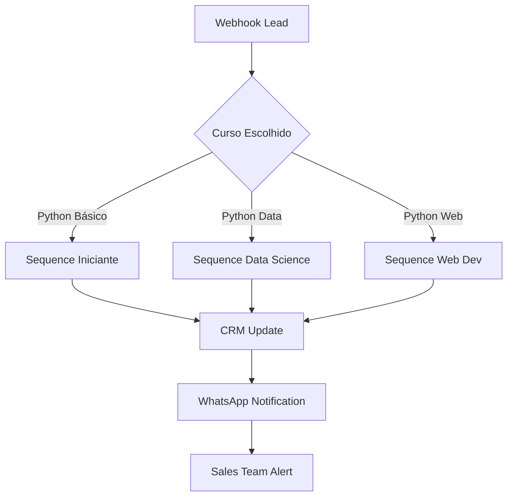

# 🔗 Integração com n8n - Incode Academy Lead System

Guia completo para configurar a automação de nutrição de leads usando n8n.

## 📋 Visão Geral

A integração com n8n permite automatizar completamente o processo de nutrição dos leads captados, incluindo:

- ✅ Envio de emails de boas-vindas
- ✅ Sequências de nutrição personalizadas por curso
- ✅ Integração com CRM/WhatsApp
- ✅ Notificações para equipe de vendas
- ✅ Relatórios automáticos

## 🚀 Configuração Rápida

### Passo 1: Configurar Webhook no n8n

1. Acesse seu n8n (cloud ou self-hosted)
2. Crie um novo workflow
3. Adicione um node "Webhook" como trigger
4. Configure:
   - **HTTP Method**: POST
   - **Path**: `/webhook/incode-leads`
   - **Response Mode**: Return immediately

### Passo 2: Configurar Variável de Ambiente

```bash
# No arquivo .env do backend
N8N_WEBHOOK_URL=https://seu-n8n.app/webhook/incode-leads
```

### Passo 3: Estrutura dos Dados Recebidos

O sistema envia os seguintes dados para o n8n:

```json
{
  "lead_id": 123,
  "nome": "João Silva",
  "email": "joao@email.com",
  "telefone": "11987654321",
  "idade": 25,
  "curso": "Python Full",
  "origem": "website",
  "timestamp": "2024-01-15T14:30:00.000Z",
  "empresa": "Incode Academy"
}
```

## 🎯 Workflows Sugeridos

### 1. Workflow Básico de Boas-Vindas

```json
{
  "nodes": [
    {
      "name": "Webhook Incode",
      "type": "n8n-nodes-base.webhook",
      "position": [240, 300],
      "parameters": {
        "path": "incode-leads",
        "httpMethod": "POST"
      }
    },
    {
      "name": "Email Boas-Vindas",
      "type": "n8n-nodes-base.emailSend",
      "position": [460, 300],
      "parameters": {
        "to": "={{ $json.email }}",
        "subject": "🎉 Bem-vindo à Incode Academy, {{ $json.nome }}!",
        "emailType": "html",
        "message": "..."
      }
    }
  ]
}
```

### 2. Workflow Avançado com Segmentação



## 📧 Templates de Email

### Template Boas-Vindas Python Básico

```html
<!DOCTYPE html>
<html>
<head>
    <meta charset="utf-8">
    <title>Bem-vindo à Incode Academy</title>
</head>
<body style="font-family: Arial, sans-serif; background: #0a0a0a; color: #ffffff;">
    <div style="max-width: 600px; margin: 0 auto; padding: 20px;">
        <h1 style="color: #00ff88; text-align: center;">
            🐍 Bem-vindo à Jornada Python!
        </h1>
        
        <p>Olá <strong>{{ $json.nome }}</strong>,</p>
        
        <p>Que incrível ter você conosco na <strong>Incode Academy</strong>! 🎉</p>
        
        <p>Você escolheu o curso <strong>{{ $json.curso }}</strong> e estamos empolgados para transformar seu futuro através da programação.</p>
        
        <div style="background: #1a1a1a; padding: 20px; border-radius: 8px; margin: 20px 0;">
            <h3>🎯 Próximos Passos:</h3>
            <ol>
                <li>Nossa equipe entrará em contato em até 24h</li>
                <li>Você receberá o material de preparação</li>
                <li>Agendaremos sua primeira aula gratuita</li>
            </ol>
        </div>
        
        <p>Enquanto isso, que tal conhecer alguns projetos incríveis feitos por nossos alunos?</p>
        
        <div style="text-align: center; margin: 30px 0;">
            <a href="https://incode.academy/projetos" 
               style="background: #00ff88; color: #0a0a0a; padding: 15px 30px; 
                      text-decoration: none; border-radius: 25px; font-weight: bold;">
                Ver Projetos dos Alunos 🚀
            </a>
        </div>
        
        <p>Transforme seu futuro. Domine Python. Seja Incode!</p>
        
        <p>
            Atenciosamente,<br>
            <strong>Equipe Incode Academy</strong>
        </p>
    </div>
</body>
</html>
```

## 📱 Integração WhatsApp

### Node WhatsApp Business API

```javascript
// Node HTTP Request para WhatsApp API
{
  "method": "POST",
  "url": "https://graph.facebook.com/v17.0/SEU_PHONE_ID/messages",
  "headers": {
    "Authorization": "Bearer SEU_ACCESS_TOKEN",
    "Content-Type": "application/json"
  },
  "body": {
    "messaging_product": "whatsapp",
    "to": "{{ $json.telefone }}",
    "type": "template",
    "template": {
      "name": "incode_welcome",
      "language": { "code": "pt_BR" },
      "components": [
        {
          "type": "body",
          "parameters": [
            { "type": "text", "text": "{{ $json.nome }}" },
            { "type": "text", "text": "{{ $json.curso }}" }
          ]
        }
      ]
    }
  }
}
```

## 🎨 Workflows por Curso

### Python Básico - Sequência 7 Dias

```javascript
// Workflow com múltiplos delays
[
  { "delay": "0", "action": "welcome_email" },
  { "delay": "1 day", "action": "preparation_material" },
  { "delay": "3 days", "action": "first_lesson_reminder" },
  { "delay": "5 days", "action": "success_stories" },
  { "delay": "7 days", "action": "enrollment_offer" }
]
```

### Python Data Science - Sequência Avançada

```javascript
// Sequência especializada para Data Science
[
  { "delay": "0", "action": "welcome_data_scientist" },
  { "delay": "2 hours", "action": "setup_environment_guide" },
  { "delay": "1 day", "action": "jupyter_notebook_intro" },
  { "delay": "3 days", "action": "pandas_preview" },
  { "delay": "5 days", "action": "machine_learning_teaser" },
  { "delay": "7 days", "action": "career_opportunities" }
]
```

## 📊 Integração com CRM

### Hubspot Integration

```javascript
// Node HTTP Request para HubSpot API
{
  "method": "POST",
  "url": "https://api.hubapi.com/crm/v3/objects/contacts",
  "headers": {
    "Authorization": "Bearer SEU_HUBSPOT_TOKEN",
    "Content-Type": "application/json"
  },
  "body": {
    "properties": {
      "email": "{{ $json.email }}",
      "firstname": "{{ $json.nome.split(' ')[0] }}",
      "lastname": "{{ $json.nome.split(' ').slice(1).join(' ') }}",
      "phone": "{{ $json.telefone }}",
      "curso_interesse": "{{ $json.curso }}",
      "origem": "{{ $json.origem }}",
      "lifecyclestage": "lead"
    }
  }
}
```

### RD Station Integration

```javascript
// Node para RD Station
{
  "method": "POST",
  "url": "https://api.rd.services/platform/conversions",
  "headers": {
    "Authorization": "Bearer SEU_RD_TOKEN",
    "Content-Type": "application/json"
  },
  "body": {
    "event_type": "CONVERSION",
    "event_family": "CDP",
    "payload": {
      "conversion_identifier": "incode-lead-form",
      "email": "{{ $json.email }}",
      "name": "{{ $json.nome }}",
      "personal_phone": "{{ $json.telefone }}",
      "cf_curso": "{{ $json.curso }}",
      "cf_idade": "{{ $json.idade }}"
    }
  }
}
```

## 🔄 Retry Logic e Error Handling

### Configuração de Retry

```javascript
// No node HTTP Request, aba "Settings"
{
  "retryOnFail": true,
  "maxTries": 3,
  "waitBetweenTries": 1000
}
```

### Error Handling Node

```javascript
// Node IF para tratar erros
{
  "conditions": {
    "boolean": [
      {
        "value1": "={{ $json.error }}",
        "operation": "exists"
      }
    ]
  },
  "trueOutput": [
    {
      "name": "Log Error",
      "type": "n8n-nodes-base.function",
      "parameters": {
        "functionCode": "console.error('Erro ao processar lead:', $json.error); return $json;"
      }
    }
  ]
}
```

## 📈 Analytics e Relatórios

### Daily Report Workflow

```javascript
// Workflow agendado diariamente
{
  "trigger": {
    "type": "cron",
    "cron": "0 9 * * *" // Todos os dias às 9h
  },
  "nodes": [
    {
      "name": "Get Yesterday Leads",
      "type": "n8n-nodes-base.httpRequest",
      "parameters": {
        "url": "https://seu-backend.com/api/leads/stats"
      }
    },
    {
      "name": "Send Report Email",
      "type": "n8n-nodes-base.emailSend",
      "parameters": {
        "to": "vendas@incodeacademy.com",
        "subject": "📊 Relatório Diário de Leads - {{ $now.format('DD/MM/YYYY') }}"
      }
    }
  ]
}
```

## 🔧 Troubleshooting

### Problemas Comuns

1. **Webhook não recebe dados**
   - Verificar URL no .env
   - Testar conectividade: `curl -X POST sua-webhook-url`

2. **Emails não sendo enviados**
   - Verificar credenciais SMTP
   - Validar templates HTML

3. **Duplicação de leads**
   - Implementar node "Merge" com deduplicação por email

### Debug Mode

```javascript
// Node Function para debug
return [
  {
    "json": {
      "debug": true,
      "received_data": $json,
      "timestamp": new Date().toISOString(),
      "workflow_id": "{{ $workflow.id }}"
    }
  }
];
```

## 🚀 Deploy e Monitoramento

### Monitoramento de Webhook

```javascript
// Health check endpoint
app.post('/api/webhook/n8n/health', (req, res) => {
  res.json({
    status: 'OK',
    timestamp: new Date().toISOString(),
    last_lead: getLastLeadTimestamp()
  });
});
```

### Alertas de Falha

```javascript
// Node Slack/Discord para alertas
{
  "method": "POST",
  "url": "SEU_WEBHOOK_SLACK",
  "body": {
    "text": "🚨 Erro no workflow de leads: {{ $json.error }}"
  }
}
```

---

## ✅ Checklist de Configuração

- [ ] Webhook n8n configurado e testado
- [ ] Variável N8N_WEBHOOK_URL definida
- [ ] Templates de email criados
- [ ] Integração CRM configurada (opcional)
- [ ] WhatsApp Business API configurada (opcional)
- [ ] Workflows de sequência por curso criados
- [ ] Sistema de retry implementado
- [ ] Monitoramento e alertas configurados
- [ ] Testes de ponta a ponta realizados

---

💡 **Dica**: Teste sempre os workflows com dados fictícios antes de colocar em produção!

🔗 **Recursos Adicionais**:
- [Documentação n8n](https://docs.n8n.io/)
- [Templates Prontos](./n8n-templates/)
- [Webhook Tester](https://webhook.site/)

---
**🎓 Desenvolvido com ❤️ para Incode Academy**